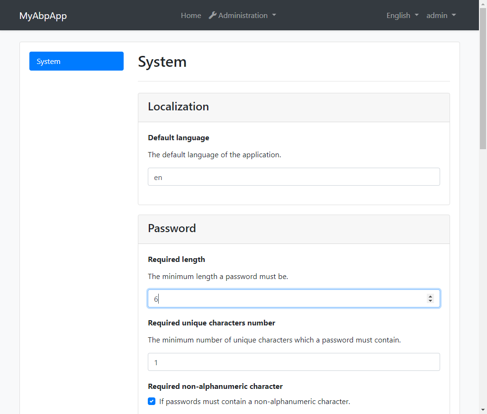
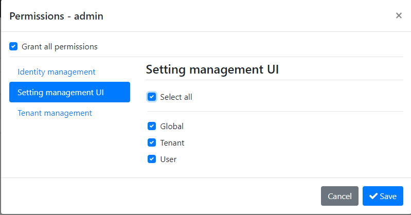

# Abp.SettingManagement.Mvc.UI

An [ABP](http://abp.io) module used to manage ABP settings



# Features

* Manage ABP settings via UI
* Support localization
* Control display of the settings via JSON (grouping, form controls, etc.)

# How to use

1. Install nuget packages

    * Application project:
    
        `Install-Package Abp.SettingManagement.Mvc.UI.Application`
    
    * Web project:

        `Install-Package Abp.SettingManagement.Mvc.UI.Web`

1. Add `DependsOn` attributes

    * Application project:

        ``` csharp
        ...
        [DependsOn(typeof(AbpSettingManagementMvcUIApplicationModule))]
        public class YourApplicationModule : AbpModule
        {
            ...
        }
        ```

    * Web project:

        ``` csharp
        ...
        [DependsOn(typeof(AbpSettingManagementMvcUIWebModule))]
        public class YourWebModule : AbpModule
        {
            ...
        }
        ```

1. Launch your ABP application, grant the following permission to your user:

    
  
1. Now your can use "Administration > Settings" menu to manage your settings!
            
# Localization

This module uses ABP's localization system to display the localization information of the settings.The languages currently supported are:

* en
* zh-Hans
  
The localization resource files are under `/Localization/AbpSettingManagementMvcUI` of the `Abp.SettingManagement.Mvc.UI.Domain.Shared` project. You can add more resource files to make this module support more languages. Welcome PRs :blush: . For ABP's localization system, please see [the document]()

# SettingProperties.json

TODO